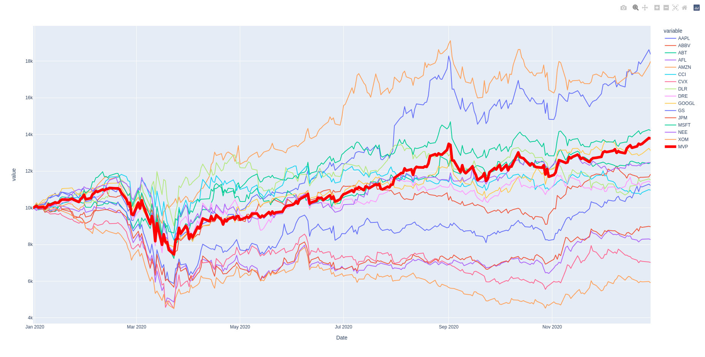
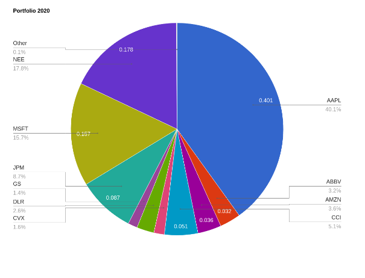

# Portfolio Optimization using Lagrangian for Positive Weight Portfolio

## Simulation description
- The total number of trading days considered to calculate a portfolio is 252 days i.e. number of trading days in a year.
- The plot uses the historic data from Jan 1, 2019 to Dec 31, 2019 to create the initial portfolio.
- The portfolio is rebalanced after every 30 trading days.
- The rebalance data required will be 252 days data into the past from the day of rebalancing.

<html>
<body>

  
  
Portfolio and individual stocks networth

 
 

  
  
Average portfolio allocation

</body>
</html>

# Portfolio-Optimization
